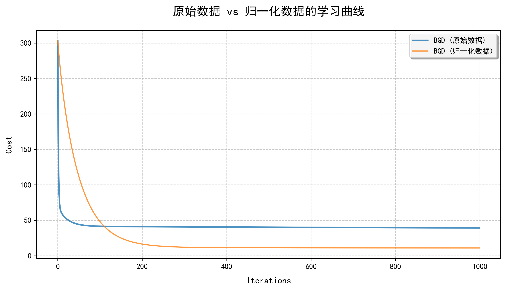
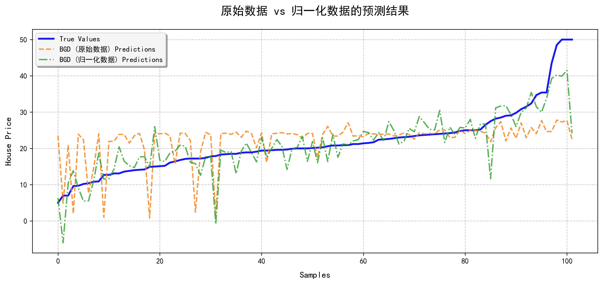
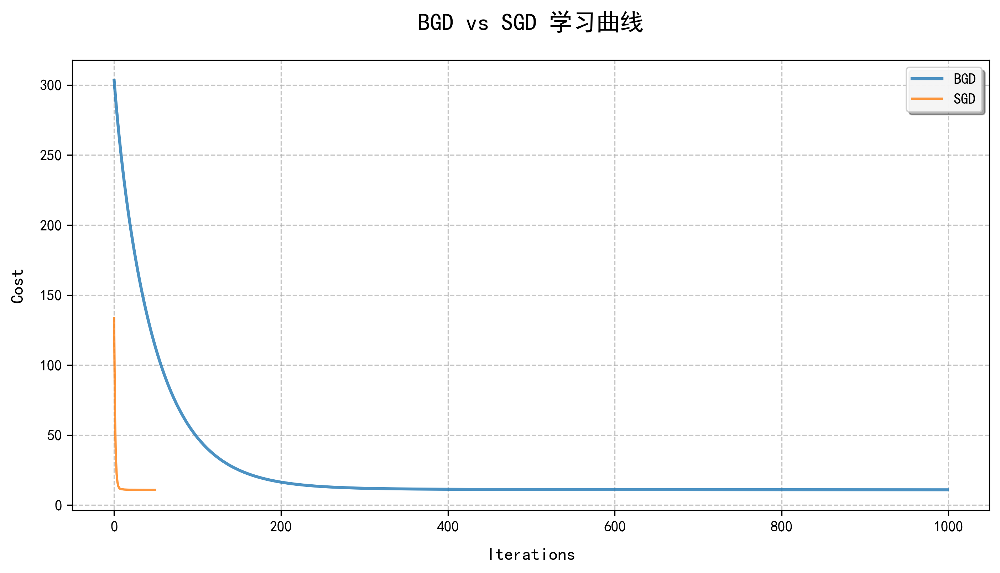
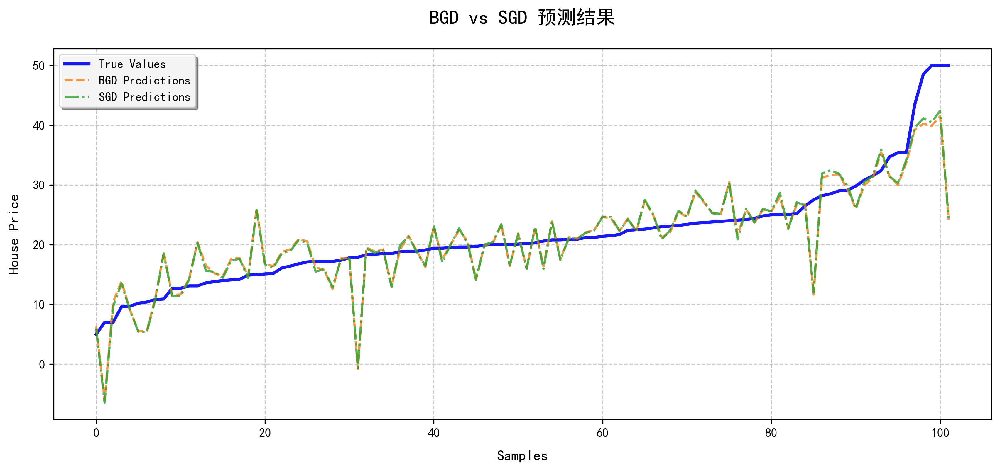
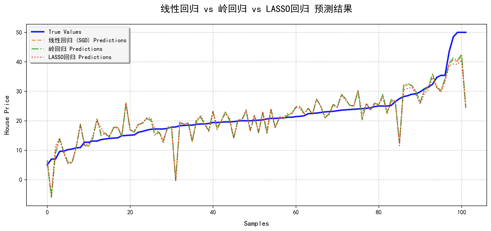
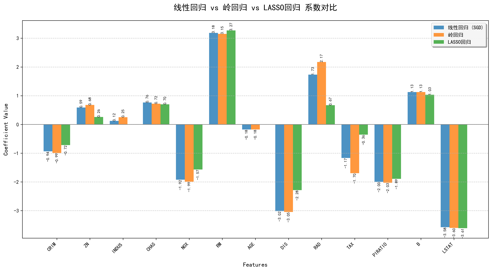

# 房价预测模型实现与分析

## 1. 实验概述

本实验针对某地区房价预测问题，实现了多种回归模型并进行了对比分析。主要完成了以下工作：

1. 采用线性回归模型的梯度下降法实现房价预测（不调用库模型）
2. 分别使用原始数据和归一化数据进行实验对比
3. 对比批处理梯度下降(BGD)与随机梯度下降(SGD)两种训练方法
4. 调用sklearn库实现岭回归和LASSO回归模型
5. 对比线性回归、岭回归和LASSO回归三种模型的性能
6. 分析三种模型的系数特点

## 2. 数据预处理与模型实现

### 2.1 数据加载与预处理

使用pandas库加载boston.csv数据集，并将数据分为特征(X)和目标变量(y)。为了提高模型训练效果，实现了数据归一化功能，将特征数据转换为均值为0、标准差为1的标准正态分布。

### 2.2 线性回归模型实现

实现了两种梯度下降算法：

1. **批处理梯度下降(BGD)**：每次迭代使用所有训练样本计算梯度
2. **随机梯度下降(SGD)**：每次迭代随机选择一个样本计算梯度，并在每次迭代前打乱数据顺序

两种算法均包含训练和预测功能，未调用第三方库的模型实现。

## 3. 实验结果分析

### 3.1 实验1：原始数据 vs 归一化数据

对比了使用原始数据和归一化数据进行BGD训练的效果：

**模型性能指标：**
- BGD (原始数据) - MSE: 66.8938, R²: 0.0878
- BGD (归一化数据) - MSE: 25.3497, R²: 0.6543

从学习曲线可以看出，归一化数据的收敛速度明显快于原始数据：

从预测结果可以看出，归一化数据训练的模型预测精度更高：

**结论**：数据归一化对梯度下降算法的性能有显著提升，主要原因是归一化消除了特征间的量纲差异，使梯度下降能够更快收敛到最优解。

### 3.2 实验2：BGD vs SGD

对比了使用归一化数据时BGD和SGD两种训练方法的效果：

**模型性能指标：**
- BGD - MSE: 25.3497, R²: 0.6543
- SGD - MSE: 24.8476, R²: 0.6612

从学习曲线可以看出，SGD的收敛过程比BGD更不稳定，但最终收敛效果略好：

从预测结果可以看出，两种方法的预测结果差异不大：

**结论**：SGD相比BGD具有更好的泛化能力和更快的收敛速度（在迭代次数相同的情况下），特别是对于大规模数据集。

### 3.3 实验3：线性回归 vs 岭回归 vs LASSO回归

对比了使用归一化数据+SGD的线性回归模型与sklearn库中的岭回归和LASSO回归模型：

**模型性能指标：**
- 线性回归 (SGD) - MSE: 24.5703, R²: 0.6650
- 岭回归 - MSE: 24.3129, R²: 0.6685
- LASSO回归 - MSE: 25.6567, R²: 0.6501

从预测结果可以看出，三种模型的预测趋势基本一致：

从系数对比可以看出三种模型的正则化效果：

**系数对比分析：**
1. **线性回归**：系数值相对较大，没有正则化约束
2. **岭回归**：系数值普遍比线性回归小，体现了L2正则化的收缩效果
3. **LASSO回归**：部分系数被压缩到接近零，体现了L1正则化的特征选择能力

**结论**：
- 岭回归在本实验中表现最好，通过L2正则化有效防止了过拟合
- LASSO回归通过L1正则化实现了特征选择，但在本实验中性能略差
- 三种模型各有优势，应根据具体问题选择合适的模型

## 4. 代码实现说明

### 4.1 主要类和函数

1. **LinearRegressionBGD类**：实现批处理梯度下降的线性回归模型
2. **LinearRegressionSGD类**：实现随机梯度下降的线性回归模型
3. **load_data函数**：加载数据集
4. **normalize_data函数**：数据归一化处理
5. **evaluate_model函数**：评估模型性能
6. **plot_learning_curves函数**：绘制学习曲线
7. **plot_predictions函数**：绘制预测结果对比
8. **plot_coefficients函数**：绘制模型系数对比

### 4.2 关键实现细节

- SGD实现中，每次迭代前通过random.shuffle打乱数据顺序
- 数据归一化处理避免了除以零的情况（std[std == 0] = 1）
- 梯度下降算法中添加了收敛条件判断（通过比较权重变化）
- 所有图表均采用了中文字体支持（SimHei）

## 5. 实验结论

1. **数据预处理的重要性**：数据归一化能显著提高梯度下降算法的收敛速度和模型性能

2. **优化算法的选择**：在本实验中，SGD相比BGD具有更好的泛化能力，尽管收敛过程更不稳定

3. **正则化方法的效果**：
   - 岭回归通过L2正则化有效防止了过拟合，在本实验中表现最佳
   - LASSO回归通过L1正则化实现了特征选择，适用于需要简化模型的场景

4. **模型评估指标**：均方误差(MSE)和决定系数(R²)是评估回归模型性能的有效指标

通过本次实验，我们深入理解了不同梯度下降算法和正则化方法在房价预测问题中的应用，为实际问题中选择合适的模型和算法提供了参考。